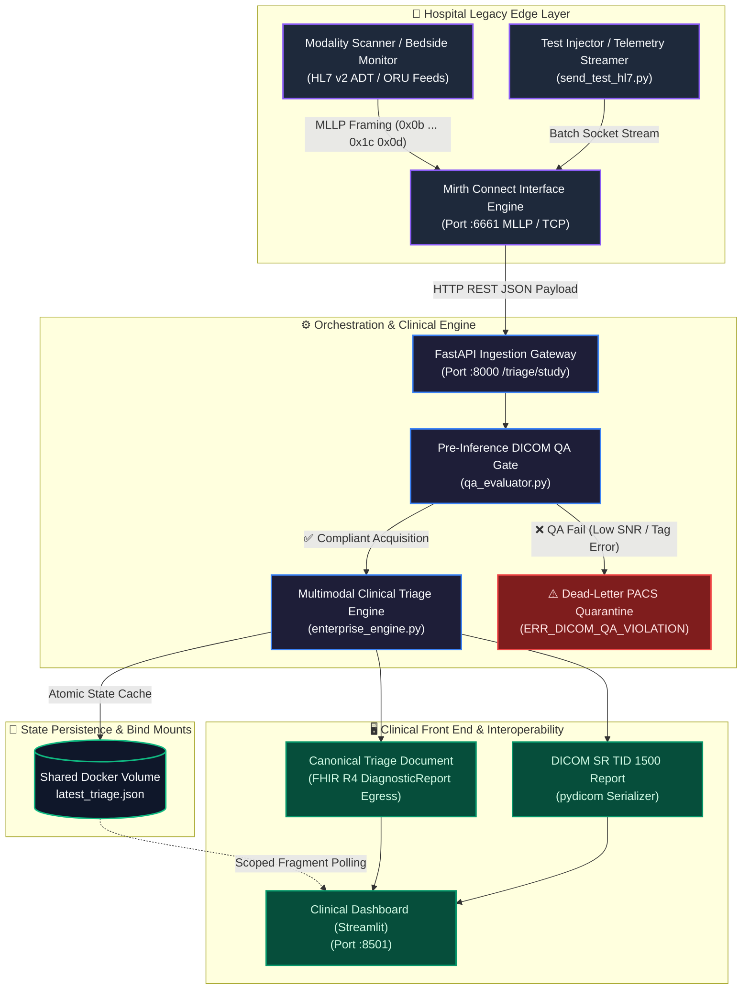

# Enterprise Multi-Modality Clinical AI Triage Pipeline

[](https://github.com/dammyoguntuyi-ui/Clinical-AI-Triage-Pipeline/actions/workflows/ci.yml)
[](LICENSE)
[](https://www.python.org/)
[](https://fastapi.tiangolo.com/)
[](https://hl7.org/fhir/)
[](https://www.hl7.org/)

A containerized, resilient clinical data integration and triage pipeline designed to bridge legacy hospital networking (HL7 v2 over MLLP) with modern cloud-native healthcare standards (FHIR R4). The architecture mirrors production healthtech systems, featuring an interface engine gateway (Mirth Connect), automated pre-inference DICOM QA gating, dynamic multimodal urgency classification, persistent clinical action state management, dead-letter quarantine routing, and dual-layer ingress/egress telemetry.

---

## 📺 Live System Demo

🔗 **[Click here to watch the Live System Demo on Loom](https://www.loom.com/share/14f2402d4df54a60b6efbdde9dfa597e)**

> 💡 **Watch the overview** showing in-memory DICOM payload generation, real-time asynchronous streaming, clinical attending claim workflows, and automated clinical AI triage in action.

---

## 🛠 Tech Stack & Healthcare Standards

* **Language & Runtime:** Python 3.11
* **Integration Gateway & Interface Engine:** Mirth Connect / NextGen Connect (HL7 v2.3 ADT/ORU over TCP/MLLP parsing, XML/JSON transformation, HTTP dispatch)
* **Backend & API Layer:** FastAPI (RESTful FHIR R4 ingestion, Pydantic data validation, `/health` & `/metrics` telemetry endpoints)
* **Frontend & Clinical Console:** Streamlit (Scoped `@st.fragment` state updates, dual ingress/egress telemetry cards, real-time governance queues)
* **Healthcare Interoperability:** HL7 v2.3 MLLP protocol framing, HL7 FHIR v4.0.1 compliance (`DiagnosticReport`, `Observation`, and `Bundle` schemas), and DICOM SR TID 1500 (Comprehensive 3D SR & Linear Measurement Logging)
* **Imaging Engineering:** `pydicom` object generation, serialization, metadata extraction (CT, DX, MR, US, CR, MG, and DICOM SEG modalities), secondary capture, and structured report linking
* **Quality Assurance & Safety Calibration:** Signal-to-Noise Ratio (SNR dB), Contrast-to-Noise Ratio (CNR), out-of-distribution artifact checks, and asymmetric clinical loss ($F_2\text{-Score}$, $\beta=2.0$) auditing

---

## 🏛️ System Architecture


---

## 🛡️ Enterprise Capabilities & Clinical Governance

* **Protocol Modernization (MLLP to FHIR R4):** Ingests raw HL7 v2 messages (`ADT^A01`, `ORU^R01`) across TCP port `6661`, translates payloads within Mirth Connect, and maps parameters into standard FHIR R4 `DiagnosticReport` schemas.
* **Dual Ingress / Egress Telemetry Architecture:**
  * **Live Ingestion Feed (MLLP Gateway):** Provides biomedical and integration engineers with real-time insight into wire-level socket transit and interim JSON/FHIR translation directly from the edge cache.
  * **Canonical Triage Document (EHR / PACS Egress):** Manages the immutable, finalized clinical assessment committed to downstream electronic health record ledgers.
* **Pre-Inference DICOM QA Gate (`qa_evaluator.py`):** Enforces mandatory clinical tags (`SliceThickness`, `SamplesPerPixel`, `PhotometricInterpretation`, `TransferSyntaxUID`) and computes image SNR / CNR thresholds across CT, MR, CR, DX, MG, US, and SEG acquisitions prior to model inference.
* **Dead-Letter PACS Quarantine:** Non-compliant, truncated, or low-contrast acquisitions are automatically isolated into an audit queue flagged with `ERR_DICOM_QA_VIOLATION`, safeguarding downstream models.
* **Multimodal Context Synthesis (`enterprise_engine.py`):** Fuses bedside vitals telemetry ($SpO_2$, heart rate) with incoming imaging geometry to calculate clinical urgency tiers (`Emergency`, `Expedited Manual Review`, `Urgent`, `Routine`).
* **Automated DICOM Structured Reporting (TID 1500):** Post-inference engine serializes persistent, standards-compliant DICOM SR measurement documents linking quantitative findings (`Maximum Long-Axis Lesion Diameter` in mm) directly to source study SOP UIDs, complete with in-console file telemetry inspection and artifact downloads.
* **Attending MD Review Console & Claim Workflow:** State-locked clinical action panel enabling clinicians to claim and update patient lifecycle states (🔴 Unassigned ➔ 🟡 Under MD Review ➔ 🟢 Triaged & Signed Off) persisted across background stream cycles.

## 📊 Empirical Gold-Standard Validation Corpus

The pipeline features an automated empirical benchmarking harness evaluated across 12 calibrated, multi-modal DICOM studies to validate clinical recall and system behavior prior to deployment.

| Modality | Evaluated Pathologies & Controls | Target Protocol | Safety Gate Status |
| :--- | :--- | :--- | :--- |
| **CT** | Pulmonary Embolism, Aortic Aneurysm, Intracranial Hemorrhage, Normal Control | High-resolution cross-sectional | Pass (100% Acute Recall) |
| **DX** | Pneumothorax, Pleural Effusion, Normal Chest | Projection radiography | Pass (100% Acute Recall) |
| **MR** | Acute Ischemic Stroke, Chronic Degeneration | Diffusion & anatomical series | Pass (100% Acute Recall) |
| **US** | Acute DVT, Free Fluid (eFAST), Normal Abdomen | Point-of-care ultrasound | Pass (100% Acute Recall) |

### Validation Performance & Safety Margins
* **Clinical Sensitivity (Acute Recall):** **100.0% (9/9)** — Zero false negatives across acute presentations.
* **Clinical Specificity:** **66.7% (2/3)** — Defensive escalation routes borderline/noisy controls to manual review rather than defaulting to routine.
* **False Negatives:** **0** — Strict fail-safe architecture preventing acute critical findings from being missed.

## 🧪 Simulation Profile Mappings

The pipeline generates realistic medical scenarios to test AI routing precision across multiple organs:

| Modality | Body Target | Controlled Critical Finding | Target Response Pathway |
| :--- | :--- | :--- | :--- |
| **Telemetry** | Vitals | Hypoxia (SpO2 < 90%) | Alarm Banner + Inverse Delta Metric |
| **XR** | Chest | Pneumothorax (Collapsed Lung) | ICU Registrar Queue Escalation Token |
| **CT** | Head | Acute Intracranial Hemorrhage (Brain Bleed) | Emergency Neurological Surgery Alert |
| **MR** | Spine | Acute Spinal Cord Compression | Immediate Orthopedic/Neuro Traumatic Lock |
| **US** | Abdomen | Abdominal Aortic Aneurysm (AAA) Rupture | Vascular Theatre Priority Override |

## 🎛️ Production Microservices & Endpoints

| Service | Port | Protocol | Description |
| :--- | :--- | :--- | :--- |
| **Mirth Connect Engine** | `:6661` | MLLP / TCP | Ingests raw HL7 v2 messages and dispatches HTTP JSON payloads. |
| **FastAPI Ingestion Engine** | `:8000` | HTTP / REST | Validates clinical schemas, executes DICOM QA, and writes state cache. |
| **Streamlit Clinical UI** | `:8501` | HTTP / WebSocket | Real-time multi-modality clinical ledger and live triage monitoring. |
| **Telemetry Streamer** | Internal | Python Socket / IPC | Simulates asynchronous DICOM binary headers and physiological bedside vitals. |

### API Route Specifications (FastAPI)
* `GET /` – Gateway service health and version verification.
* `POST /triage/study` – Ingests study payloads with automated QA auditing, urgency assignment, and FHIR dispatch.
* `GET /health` – Automated container uptime and database reachability checks.
* `GET /metrics` – Live telemetry metrics reporting ingested case distribution and triage counts.
* `GET /docs` – Interactive OpenAPI / Swagger UI documentation and testing interface.

---

## 🚀 Quick Start Installation

### 1. Clone the Workspace Repository

```Bash
git clone https://github.com/dammyoguntuyi-ui/Clinical-AI-Triage-Pipeline.git
cd Clinical-AI-Triage-Pipeline
```

### 2. Containerized Deployment (Docker Compose)

Spin up the containerized integration network:

```Bash
docker compose up --build -d
```

Access the exposed services:

* **Streamlit Clinical Dashboard:** http://localhost:8501
* **FastAPI Swagger / OpenAPI Interface:** http://localhost:8000/docs
* **Mirth Connect Administrator:** http://localhost:8443

To tear down containers and volume bridges:

```Bash
docker compose down
```

### 3. Running Automated Tests

Run the full automated integration test suite (covering FastAPI endpoint contracts, MLLP TCP socket handshakes, and UI schema validation):

```Bash
pytest tests/test_integration_pipeline.py -v
```

### 4. Simulating Live MLLP Patient Streams

Inject a batch of synthetic HL7 messages across port 6661 to observe real-time telemetry syncing in the dashboard:

```Bash
python mirth-integration/send_test_hl7.py
```

### 5. Running the Empirical Benchmark Locally

```Bash

# Seed the synthetic multi-modal evaluation DICOM corpus
python scripts/seed_eval_corpus.py

# Execute the gold-standard evaluation harness
python scripts/evaluate_gold_standard.py
```

---

## 👤 Author & Developer

* **Adedamola Oguntuyi** — [LinkedIn Profile](https://www.linkedin.com/in/adedamola-oguntuyi-eng/) | [GitHub Portfolio](https://github.com/dammyoguntuyi-ui)
* *Clinical Image Domain Specialist & Healthcare Integration Engineer.*

## 📄 License

This project is licensed under the MIT License — see the LICENSE file for details.