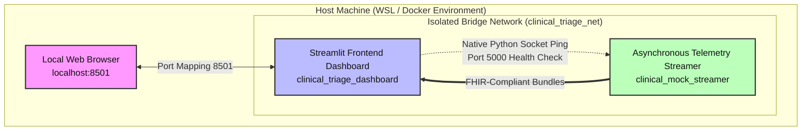

# Enterprise Multi-Modality Clinical AI Triage Pipeline

A containerized, resilient, and highly available clinical data ingestion pipeline designed to simulate a real-time hospital environment. The architecture mirrors modern healthtech infrastructure, leveraging an asynchronous streaming microservice feeding a unified frontend dashboard utilizing defensive parsing principles to maintain zero-downtime operations.

## 🩺 Tech Stack & Healthcare Standards

* **Language:** Python 3.x
* **Frontend Framework:** Streamlit (Utilizing advanced state handling and `@st.fragment` scheduling)
* **Data Layout Standards:** HL7/FHIR v4.0.1 compliance representations (Observation & Bundle schemas)
* **Imaging Formats:** DICOM Metadata Attribute Extraction Simulation (XR, CT, MR, US modalities)
* **Data Engineering:** Pandas (In-memory structural ledger manipulation and chronological vector tracking)

---

## 🏗️ System Architecture

The following diagram illustrates how the components interact across the isolated virtual bridge network, highlighting the native socket-based health telemetry monitoring:



## 🛠️ Core Features & Engineering Highlights

* **Asynchronous Clinical Simulation:** Streamer generates comprehensive pseudo-random patient bundles integrating both telemetry data (SpO2 vitals tracking) and optional multi-modality diagnostic imaging strings (CT, MR, XR findings).

* **Native Infrastructure Health Checks:** Built without heavy Linux package dependencies using a native Python socket implementation inside docker-compose.yml to verify pipeline connectivity.

* **Graceful Degradation & Self-Healing:** The dashboard dynamically traps KeyError exceptions and connectivity failures to display specialized clinical fallback UI views rather than triggering unhandled tracebacks.

* **Automated Integration Testing Suite:** Comprehensive automated verification using pytest to guarantee system stability against missing fields, data schema drifts, and polymorphic DICOM header shifts.

## 🧪 Simulation Profile Mappings

The pipeline generates realistic medical scenarios to test AI routing precision across multiple organs:

| Modality | Body Target | Controlled Critical Finding | Target Response Pathway |
| :--- | :--- | :--- | :--- |
| **Telemetry** | Vitals | Hypoxia (SpO2 < 90%) | Alarm Banner + Inverse Delta Metric |
| **XR** | Chest | Pneumothorax (Collapsed Lung) | ICU Registrar Queue Escalation Token |
| **CT** | Head | Acute Intracranial Hemorrhage (Brain Bleed) | Emergency Neurological Surgery Alert |
| **MR** | Spine | Acute Spinal Cord Compression | Immediate Orthopedic/Neuro Traumatic Lock |
| **US** | Abdomen | Abdominal Aortic Aneurysm (AAA) Rupture | Vascular Theatre Priority Override |

## 🚀 Quick Start Installation

1. Clone the Workspace Repository

```Bash
git clone [https://github.com/dammyoguntuyi-ui/Clinical-AI-Triage-Pipeline.git](https://github.com/dammyoguntuyi-ui/Clinical-AI-Triage-Pipeline.git)
cd Clinical-AI-Triage-Pipeline
```

2. Set Up a Python Virtual Environment (Recommended for local running)

```Bash
python -m venv .venv
# On Windows PowerShell:
.\venv\Scripts\Activate.ps1
```

3. Containerized Deployment (Docker Compose)

To spin up the isolated, fully decoupled microservice architecture:

```Bash
docker-compose up --build
```
Once the container layers initialize, open your browser to the exposed frontend interface port: http://localhost:8501.

To cleanly stop the containers and release the isolated virtual network bridges, run:

```Bash
docker-compose down
```

4. Executing the Automated Test Suite

To verify the core data validation logic, schema fallback routing, and polymorphic DICOM header validation:

```Bash
python -m pytest test_pipeline.py -v
```

---

## 👥 Author & Developer

* **Adedamola Oguntuyi** * [LinkedIn Profile](https://www.linkedin.com/in/adedamola-oguntuyi-80347a332/)
  * [GitHub Portfolio](https://github.com/dammyoguntuyi-ui)
  * *Clinical Radiographer specializing in Medical Data Science & Healthcare AI Ingestion Pipelines.*