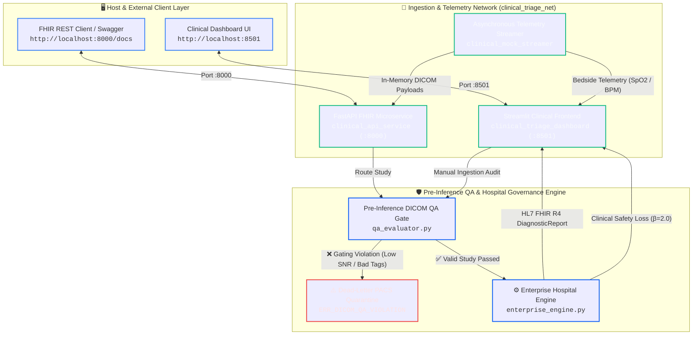

# Enterprise Multi-Modality Clinical AI Triage Pipeline

[](https://github.com/dammyoguntuyi-ui/Clinical-AI-Triage-Pipeline/actions/workflows/ci.yml)
[](LICENSE)
[](https://www.python.org/)
[](https://fastapi.tiangolo.com/)
[](https://hl7.org/fhir/)

A containerized, resilient, and highly available clinical data ingestion pipeline designed to simulate a real-time hospital environment. The architecture mirrors modern healthtech infrastructure, leveraging an asynchronous streaming microservice feeding a unified frontend dashboard, pre-inference DICOM QA gating, dynamic multi-tier urgency filtering, persistent clinical action state management, dead-letter quarantine routing, and downstream HL7 FHIR R4 report generation.

---

🎥 **Live System Demo**

🔗 [Click here to watch the 2-minute Live System Demo on Loom](https://www.loom.com/share/531a29bfa65c4d6aa4623eb7eb0c6750)

> 💡 **Watch the 2-minute overview** showing in-memory DICOM payload generation, real-time asynchronous streaming, and automated clinical AI triage in action.

---

## 🛠 Tech Stack & Healthcare Standards

* **Language:** Python 3.11
* **Backend & API Layer:** FastAPI (RESTful FHIR R4 ingestion, Pydantic data validation, `/health` & `/metrics` telemetry endpoints)
* **Frontend & Clinical Console:** Streamlit (Utilizing advanced state handling, `@st.fragment` background scheduling, and real-time governance queues)
* **Healthcare Interoperability:** HL7/FHIR v4.0.1 compliance representations (`DiagnosticReport`, `Observation`, and `Bundle` schemas)
* **Imaging Formats & Engineering:** `pydicom` object generation, serialization, and metadata attribute extraction (XR, CT, MR, US, CR, MG, and DICOM SEG modalities)
* **Quality Assurance & Safety Calibration:** Signal-to-Noise Ratio (SNR dB), Contrast-to-Noise Ratio (CNR), out-of-distribution artifact checks, and asymmetric clinical loss ($F_2\text{-Score}$, $\beta=2.0$) auditing

---

## 🏛️ System Architecture


---

## 🛡️ Enterprise Capabilities & Clinical Governance

* **Pre-Inference DICOM QA Gate (qa_evaluator.py):** Enforces mandatory clinical tags (SliceThickness, SamplesPerPixel, PhotometricInterpretation, TransferSyntaxUID) and computes image SNR / CNR thresholds across CT, MR, CR, DX, MG, US, and SEG studies prior to model inference.
* **Dead-Letter PACS Quarantine:** Non-compliant, truncated, or low-contrast acquisitions are automatically isolated into an audit queue flagged with ERR_DICOM_QA_VIOLATION, preventing downstream pipeline crashes.
* **Multimodal Context Synthesis (enterprise_engine.py):** Fuses bedside vitals telemetry ($SpO_2$, heart rate) with incoming imaging geometry to calculate clinical urgency tiers (Emergency, Urgent, Routine).
* **HL7 FHIR R4 Dispatcher:** Automatically generates structured, compliant FHIR R4 DiagnosticReport JSON bundles containing clinical findings and metadata extensions.
* **Clinical Loss Calibration ($\beta=2.0$):** Measures triage safety via asymmetric $F_2\text{-Score}$ to penalize false negatives heavily while continuously monitoring false-positive alarm fatigue.
* **Master Clinical Ledger & Multi-Tier Filtering:** Real-time synchronized queue with dynamic filtering across urgency tiers (Emergency, Urgent, Routine) and imaging attachment status (Attached Imaging Only, Pending Imaging Only).
* **Attending MD Review Console & Claim Workflow:** State-locked clinical action panel enabling clinicians to claim and update patient lifecycle states (🔴 Unassigned ➔ 🟡 Under MD Review ➔ 🟢 Triaged & Signed Off) persisted across background stream cycles.

## 🧪 Simulation Profile Mappings

The pipeline generates realistic medical scenarios to test AI routing precision across multiple organs:

| Modality | Body Target | Controlled Critical Finding | Target Response Pathway |
| :--- | :--- | :--- | :--- |
| **Telemetry** | Vitals | Hypoxia (SpO2 < 90%) | Alarm Banner + Inverse Delta Metric |
| **XR** | Chest | Pneumothorax (Collapsed Lung) | ICU Registrar Queue Escalation Token |
| **CT** | Head | Acute Intracranial Hemorrhage (Brain Bleed) | Emergency Neurological Surgery Alert |
| **MR** | Spine | Acute Spinal Cord Compression | Immediate Orthopedic/Neuro Traumatic Lock |
| **US** | Abdomen | Abdominal Aortic Aneurysm (AAA) Rupture | Vascular Theatre Priority Override |

## 🎛️ Production Microservices & Endpoints

| Service | Port | Protocol | Description |
| :--- | :--- | :--- | :--- |
| **FastAPI Ingestion Engine** | `:8000` | HTTP / REST | Ingests FHIR R4 Bundles, executes defensive DICOM parsing, and reports telemetry. |
| **Streamlit Clinical UI** | `:8501` | HTTP / WebSocket | Real-time multi-modality clinical ledger and live triage monitoring. |
| **Telemetry Streamer** | Internal | Python Socket / IPC | Simulates asynchronous DICOM binary headers and physiological bedside telemetry. |

### API Route Specifications (FastAPI)
* `GET /` – Gateway service health and version verification.
* `POST /triage/study` – Ingests multi-modality study payloads with automated QA auditing and FHIR triage synthesis.
* `GET /health` – Automated container uptime and database reachability checks.
* `GET /metrics` – Live telemetry metrics reporting ingested case distribution and triage counts.
* `GET /docs` – Interactive OpenAPI / Swagger UI documentation and testing interface.

---

## 🚀 Quick Start Installation

### 1. Clone the Workspace Repository

```Bash
git clone https://github.com/dammyoguntuyi-ui/Clinical-AI-Triage-Pipeline.git
cd Clinical-AI-Triage-Pipeline
```

### 2. Containerized Deployment (Docker Compose)

To spin up the isolated, fully decoupled microservice architecture:

```Bash
docker compose up --build -d
```

Once the container layers initialize, open your browser to access the exposed services:

* **Streamlit Clinical Dashboard:** http://localhost:8501
* **FastAPI Swagger / OpenAPI Interface:** http://localhost:8000/docs

To stop the containers and release network bridges:

```Bash
docker compose down
```

### 3. Executing the Automated Test Suite

To verify core data validation logic, multi-modality QA rules, and FHIR dispatch integration across 18 test cases:

```Bash
docker compose exec api pytest -v
```

---

## 👤 Author & Developer

* **Adedamola Oguntuyi** — [LinkedIn Profile](https://www.linkedin.com/in/adedamola-oguntuyi-eng/) | [GitHub Portfolio](https://github.com/dammyoguntuyi-ui)
* *Clinical Radiographer specializing in Medical Data Science & Healthcare AI Ingestion Pipelines.*

## 📄 License

This project is licensed under the MIT License — see the LICENSE file for details.