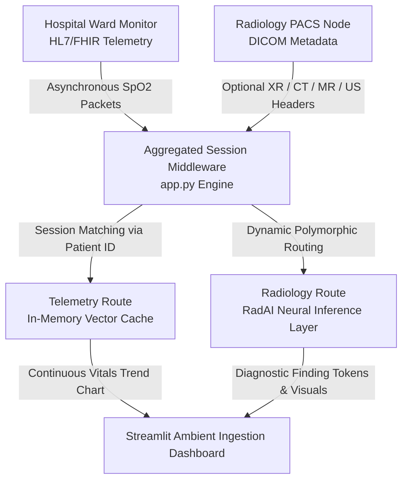

# 🏥 Enterprise Multi-Modality Clinical AI Triage Pipeline

An asynchronous, event-driven data integration and triage pipeline engineered to solve healthcare data fragmentation. The system ingests and aggregates real-time **HL7/FHIR telemetry vectors** alongside polymorphic **DICOM radiology imaging headers (XR, CT, MR, US)** into a unified clinical encounter session, simulating automated background AI diagnostic inference for high-priority emergency routing.

---

## 🚀 Key Architectural Features

* **Multi-Modality Ingestion & Polymorphism:** Simultaneously consumes and parses distinct healthcare data shapes—structured text-based patient vital streams and deep binary imaging metadata blocks.
* **Aggregated Middleware Design:** Eliminates standard hospital machine silos by dynamically matching disparate network feeds (ward beds vs. radiology PACS networks) into a single unified session bound by a `Patient ID`.
* **Asynchronous Reality Emulation:** Accounts for real-world physical constraints of radiology environments (e.g., monitor disconnects due to MRI safety or CT streak artifact prevention) by tracking and graphing historical parameters alongside active imaging diagnostic slots.
* **Live Ambient Monitor Fragment Loop:** Leverages a non-blocking UI fragment lifecycle mechanism that auto-polls the core ingestion engine every 20 seconds, mimicking an intensive care dashboard or stroke triage queue without freezing the user interface thread.

---

## 📂 System Architecture & Data Flow



1. Generation: The streaming module creates a synchronized patient record packet containing mandatory core vitals and an optional random assignment to a radiology exam type based on clinical probability.
2. Parsing: The extraction module reads incoming resource structures. Telemetry updates numeric vector history, while radiology nodes split off into specific diagnostic tracks (e.g., matching a Head CT to a brain bleed classification).
3. Prioritization: If an abnormality crosses a clinical threshold or an AI model flags a critical diagnostic finding, the triage engine shifts the record's priority state to HIGH PRIORITY and updates the visual container layer immediately.

## 🛠️ Tech Stack & Healthcare Standards

Language: Python 3.x
Frontend Framework: Streamlit (Utilizing advanced state handling and @st.fragment scheduling)
Data Layout Standards: HL7/FHIR v4.0.1 compliance representations (Observation & Bundle schemas)
Imaging Formats: DICOM Metadata Attribute Extraction Simulation (XR, CT, MR, US modalities)
Data Engineering: Pandas (In-memory structural ledger manipulation and chronological vector tracking)

## 💻 Local Quickstart Installation

### 1. Clone the Workspace Repository
```bash
git clone https://github.com/dammyoguntuyi-ui/Clinical-AI-Triage-Pipeline.git
cd Clinical-AI-Triage-Pipeline
```

### 2. Set Up a Python Virtual Environment (Recommended)
```Bash
python -m venv .venv
# On Windows PowerShell:
.\.venv\Scripts\Activate.ps1
```

### 3. Install Core Project Dependencies
```Bash
pip install streamlit pandas
```
### 4. Execute the Application Pipeline Engine
Run the Streamlit entrypoint script via your active python module mapper:
```Bash
python -m streamlit run app.py
```
Open your browser to http://localhost:8501 to view the live processing grid.

## 🧪 Simulation Profile Mappings

The pipeline generates realistic medical scenarios to test AI routing precision across multiple organs:

| Modality | Body Target | Controlled Critical Finding | Target Response Pathway |
| :--- | :--- | :--- | :--- |
| **Telemetry** | Vitals | Hypoxia (SpO2 < 90%) | Alarm Banner + Inverse Delta Metric |
| **XR** | Chest | Pneumothorax (Collapsed Lung) | ICU Registrar Queue Escalation Token |
| **CT** | Head | Acute Intracranial Hemorrhage (Brain Bleed) | Emergency Neurological Surgery Alert |
| **MR** | Spine | Acute Spinal Cord Compression | Immediate Orthopedic/Neuro Traumatic Lock |
| **US** | Abdomen | Abdominal Aortic Aneurysm (AAA) Rupture | Vascular Theatre Priority Override |

---

## 👥 Author & Developer

* **Adedamola Oguntuyi** * [LinkedIn Profile](https://www.linkedin.com/in/adedamola-oguntuyi-80347a332/)
  * [GitHub Portfolio](https://github.com/dammyoguntuyi-ui)
  * *Clinical Radiographer specializing in Medical Data Science & Healthcare AI Ingestion Pipelines.*